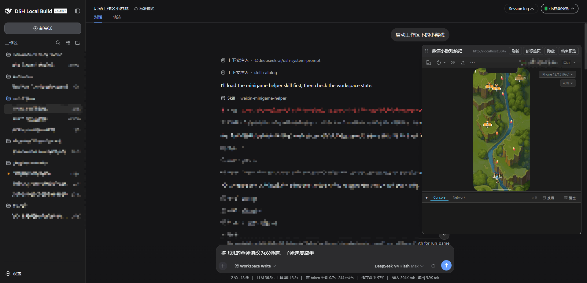

# @trujaycc/dsh-weixin-minigame

English | [中文](README.zh.md)

Preview, develop, and debug (through logs and screenshots) WeChat Mini Games inside the dsh Web GUI. Modelled on the official [WeChat Mini Game Helper](https://gamemp.weixin.qq.com/doc/minigame-helper/guide/vscode-plugin.html).



## What it gives you

| Surface | What it does |
| --- | --- |
| **Preview panel** | A floating preview window inside the interface that can be opened on its own. Both the preview and the credentials are managed by the official mini game helper service; this plugin neither stores nor uploads anything. |
| **`weixin-minigame-helper` skill** | Guidance for the MCP tools and this plugin, and for the game development workflow. |
| **MCP bridge** | Connects dsh to the mini game helper service. |

## What you can do

### From your side

Triggered by natural language.

| You want to | Example prompt |
| --- | --- |
| See the game running | "Bring the mini game project in the current workspace up so I can look at it" |
| Fix a crash or a blank screen | "Preview the current workspace mini game and keep fixing until the log is clean" |
| Check what the frame actually renders | "Take a screenshot after that change so I can see it" |
| Try it on a real phone | "Run a real-device test on the current workspace mini game" |
| Ship a version | "Publish the current workspace mini game as 1.0.1, note: score fix" |

### From the capability side

| Capability | Backing MCP tools |
| --- | --- |
| Start or hot-reload the preview | `run_game` |
| Read console output and errors | `get_logs` |
| Capture the rendered frame, single or burst | `capture_screenshot`, `capture_screenshot_burst`, `stop_screenshot_burst` |
| Real-device QR preview | `real_device_preview` |
| Upload a version to the WeChat platform | `publish` |
| Platform launch workflow — game info, filing, qualification, version submission | `open_onboarding` and the `mp_*` family |

## Install

- Requires: dsh Web, Node `^22.19.0` or `>=24.0.0` (the same range dsh itself requires), npx
- Not required: WeChat DevTools (install it if you want to debug code yourself)

### From npm

```sh
dsh plugin --profile web add @trujaycc/dsh-weixin-minigame
```

Then **restart `dsh web`**: the client-module registry caches package metadata for the life of the process, so a newly added row is only discovered at the next boot. After that, edits to `lib/client.js` reload on their own through the always-mounted client HMR chain.

### From a local checkout (developing this plugin)

```sh
pnpm install
pnpm run build
dsh plugin --profile web add <absolute path to this plugin>
```

Installing from a **directory** creates a link to the checkout, so a later `pnpm run build` takes effect without reinstalling. The first activation still needs the `dsh web` restart above.

To verify what npm would actually publish, use a tarball instead:

```sh
pnpm pack
dsh plugin --profile web add ./trujaycc-dsh-weixin-minigame-0.1.0.tgz
```

A tarball is an unpacked copy, so later code changes need another `pnpm pack` and a reinstall.

### Uninstall

```sh
dsh plugin --profile web remove @trujaycc/dsh-weixin-minigame
```

## The game project itself

- A WeChat Mini Game directory containing `game.js`.
- Real-device preview and publish additionally need a WeChat **AppID** and an **upload private key**, configured through the ⚙️ button in the preview page; see the [official documentation](https://gamemp.weixin.qq.com/doc/minigame-helper/guide/vscode-plugin.html).

## Effect on dsh

### Skill injection

One skill joins the session catalog — `weixin-minigame-helper`, described as the preview/repair loop for WeChat mini game code. Its body is loaded only when the model calls the `skill` tool; the catalog itself carries the name and description alone, capped by the harness's catalog limit.

### No other prompt injection

No system-prompt section is registered, so nothing is paid on unrelated turns. The MCP tool schemas come from the upstream service and are registered only after a successful handshake; a bridge that fails to start merely leaves those tools absent and does not affect dsh startup.

### Interface

A trigger button joins the top-right of the session header (the lamp on its left is green while a project is running, grey when idle, and hollow when the plugin is not mounted), alongside a floating window that embeds the official mini game helper preview service.

## Known Limitations and Deferred Work

- **The upstream MCP server is a third-party dependency.** It is fetched by `npx` at boot, with the version pinned in `cordis.patch.yml` (currently `0.1.35`). Tool names, parameters, and behaviour can change with an upstream release, so run this plugin's tests before bumping that pin.
- **The official mini game helper service leaves files in the game project** (screenshots, and so on). Add them to `.gitignore` yourself.
- **One preview server per machine, shared across dsh instances.** The helper records where it listens in a single file under the user's home directory, and the first one to bind takes the default port, so a second dsh process running this plugin overwrites that record and serves on the next free port.
- **The preview status is readable by any caller on the loopback interface.** It exposes nothing but a local address, so that is proportionate; there is no authentication beyond it.
- **Restart required for first activation.** The client-module registry's package metadata cache never expires, so a freshly installed plugin is invisible until `dsh web` restarts.

## Develop

```sh
pnpm install
pnpm run typecheck
pnpm test
pnpm run build    # emits lib/index.js and lib/client.js (ModuleLoader handoff)
```

The client bundle resolves `react` from the dsh Web loader's platform module table and declares no other runtime dependency.

`pnpm run watch` rebuilds `lib/client.js` on change; the client HMR chain reloads the plugin in the browser without a page refresh.

## References

The workflow this plugin guides the agent through, and the way it drives the MCP server, are modelled on the official [WeChat Mini Game Helper](https://gamemp.weixin.qq.com/doc/minigame-helper/guide/vscode-plugin.html).

The MCP service is `@weadmin/weixin-minigame-helper-mcp`. It is fetched with `npx` at runtime and is not redistributed with this package.
